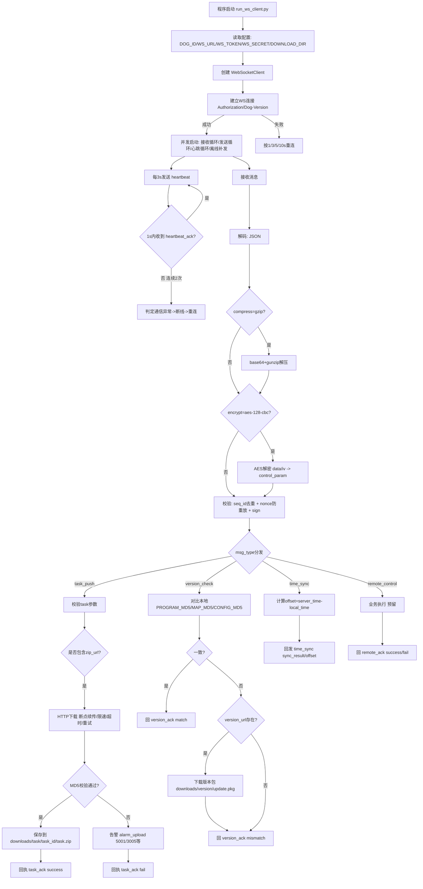

# 4.1 WebSocket服务器通信模块 详细技术文档
## 4.1.1 通信规范（细化版）
### 4.1.1.1 协议栈与传输层适配
| 协议类型       | 应用场景                          | 传输特性                          | 底层依赖                     |
|----------------|-----------------------------------|-----------------------------------|------------------------------|
| WebSocket      | 实时指令交互、状态上报、心跳保活  | 全双工、长连接、低延迟（≤100ms）  | TCP/IP（默认80/443端口）     |
| HTTP/HTTPS     | 大文件传输（程序包/地图包/视频）  | 断点续传、分片下载、带宽适配      | TLS1.3（HTTPS）、HTTP/1.1    |
| UDP            | 心跳兜底、离线状态极简上报        | 无连接、低开销、不可靠            | 局域网/公网UDP（端口动态分配）|

### 模块程序图


### 4.1.1.2 连接生命周期管理
1. **连接建立流程**
   ```mermaid
    graph TD
    A[服务器下发文件URL/MD5] --> B[上位机校验本地文件MD5]
    B -->|一致| C[跳过下载 上报校验结果]
    B -->|不一致/不存在| D[异步下载 aiohttp]
    D --> E{下载中}
    E -->|网络中断| F[记录断点位置 重连后续传]
    E -->|完成| G[分段MD5校验 每1MB校验1次]
    G -->|通过| H[解压/替换文件 上报成功]
    G -->|失败| I[删除损坏文件 重新下载 最多3次]
    I -->|仍失败| J[上报错误码5001 触发Level2告警]
   ```
2. **连接保活机制**
   - 心跳发送：上位机主动发送`heartbeat`消息，频率严格3s/次，消息携带当前系统时间、机器狗核心状态（电量/运动状态）；
   - 心跳回执：服务器需在1s内返回`heartbeat`回执（复用seq_id），上位机未收到则标记“心跳超时”；
   - 超时判定：连续2次心跳回执丢失（总计5s），触发“通信异常”标记，启动重连流程；
   - 重连策略：
     | 重连次数 | 间隔时间 | 附加操作                          | 终止条件               |
     |----------|----------|-----------------------------------|------------------------|
     | 1-3      | 1s       | 保留当前连接上下文，不清理任务队列 | -                      |
     | 4-6      | 3s       | 暂停非核心任务（版本同步/视频上传） | -                      |
     | 7-9      | 5s       | 标记“通信降级”，启用UDP心跳兜底   | -                      |
     | ≥10      | 10s      | 无限重试，触发Level 2告警上报     | 连接恢复/程序退出      |

3. **连接断开处理**
   - 主动断开：上位机退出/网络切换时，发送`disconnect`消息（msg_type=disconnect），携带断开原因（normal/network_switch）；
   - 被动断开：检测到TCP FIN/RST包，立即启动重连流程，同时缓存离线期间需补发的关键消息（任务结果/告警信息），按seq_id排序，连接恢复后批量补发；
   - 异常断开：核心指令下发中断开，连接恢复后优先重发该指令（最多3次），确保指令不丢失。

### 4.1.1.3 数据编解码与压缩规则
1. **基础格式**
   - 数据结构：JSON（RFC 8259），字符编码UTF-8，禁止使用BOM头；
   - 字段规范：
     - 必选字段：`msg_type`（字符串）、`dog_id`（字符串，格式：{机型}_{编号}）、`timestamp`（ISO 8601格式，如2026-05-13T14:00:00+08:00）、`seq_id`（全局唯一，格式：SEQ{时间戳}{6位随机数}）；
     - 可选字段：`sign`（消息签名）、`compress`（压缩标识）、`error_code`（错误码）；
   - 数值类型：整数（电量/错误码）、浮点数（置信度/偏移量）、布尔值（状态标识）严格区分，禁止字符串存储数值。

2. **压缩策略**
   - 触发条件：单条消息体积＞1024字节（JSON序列化后）；
   - 压缩算法：gzip（级别6，平衡压缩比与速度）；
   - 传输格式：压缩后消息需携带`compress: "gzip"`字段，消息体为Base64编码的gzip二进制数据；
   - 解压校验：服务器/上位机解压后需校验JSON格式合法性，解压失败则返回错误码（2006-消息解压失败）。

### 4.1.1.4 文件传输规范
1. **传输流程**
   ```mermaid
   graph TD
   A[服务器下发文件URL/MD5] --> B[上位机校验本地文件MD5]
   B -->|一致| C[跳过下载，上报校验结果]
   B -->|不一致/不存在| D[异步下载（aiohttp）]
   D --> E{下载中}
   E -->|网络中断| F[记录断点位置，重连后续传]
   E -->|完成| G[分段MD5校验（每1MB校验1次）]
   G -->|通过| H[解压/替换文件，上报成功]
   G -->|失败| I[删除损坏文件，重新下载（最多3次）]
   I -->|仍失败| J[上报错误码（5001），触发Level 2告警]
   ```
2. **下载规则**
   - 限速：单文件下载速度≤1MB/s，避免占用机器狗通信带宽；
   - 存储：临时文件存储至`/tmp/robot_download/`，下载完成后移动至目标目录；
   - 校验：采用分段MD5（文件每1MB生成1个MD5值），整体MD5兜底，提升校验精度与效率；
   - 超时：单次下载超时30s，断点续传最大重试5次，仍失败则标记文件下载失败。

### 4.1.1.5 安全机制（细化）
1. **身份校验**
   - 连接阶段：WebSocket握手请求携带`Authorization`请求头，格式为`Bearer {token}`，token生成规则：MD5(dog_id + 设备MAC + 服务器密钥)，有效期7天；
   - 校验失败：服务器立即断开连接，返回错误码2002，上位机记录日志并通知运维；
   - 密钥更新：token密钥每7天通过安全通道（HTTPS POST）更新，更新失败则使用旧密钥，同时上报Level 1告警。

2. **指令加密**
   - 加密范围：`remote_control`（遥控）、`return_home`（返航）、`emergency_stop`（急停）三类核心指令；当前仓库实现已覆盖`remote_control`，其余类型可按同样字段规则扩展；
   - 加密算法：AES-128-CBC，IV为16位随机数（随消息下发），密钥每24小时更新；
   - 加密流程：
     1. 序列化指令JSON为字符串；
     2. 填充字符串至16字节整数倍（PKCS7填充）；
     3. AES加密后生成Base64编码的密文；
     4. 消息体携带`encrypt: "aes-128-cbc"`、`iv: {Base64编码IV}`；
   - 解密失败：上报错误码2005，拒绝执行指令，触发Level 2告警。

3. **防重放机制**
   - 防重放字段：`timestamp`（精度1s） + `nonce`（6位随机数，单次使用）；
   - 校验规则：
     - 服务器缓存5分钟内的nonce，重复nonce直接拒绝；
     - timestamp与服务器时间差＞5s，拒绝接收（允许±1s时钟偏差）；
   - 异常处理：检测到重放攻击，立即断开连接，上报错误码2007，记录攻击源IP/时间。

## 4.1.2 消息类型与格式（扩展版）
### 4.1.2.1 消息类型全量清单（补充字段与约束）
| msg_type        | 功能           | 通信方向    | 核心必填字段                                                                 | 约束条件                                  |
|----------------|----------------|-------------|------------------------------------------------------------------------------|-------------------------------------------|
| `heartbeat`    | 心跳/状态上报  | 上位机→服务器 | battery、motion_state、error_code、seq_id                                    | 3s/次，motion_state枚举值：0-待机/1-运动/2-异常/3-充电 |
| `heartbeat_ack`| 心跳回执       | 服务器→上位机 | seq_id、server_time                                                          | 1s内返回，与心跳消息seq_id一致            |
| `task_push`    | 任务下发       | 服务器→上位机 | task_id、execute_time、route_json、priority、map_md5                          | priority 1-5，execute_time需晚于当前时间  |
| `task_pause`   | 任务暂停       | 服务器→上位机 | task_id、pause_reason、operator                                              | 仅暂停执行中/待执行任务                   |
| `task_cancel`  | 任务取消       | 服务器→上位机 | task_id、cancel_reason、operator                                              | 可取消任意状态任务，需释放路段占用        |
| `task_ack`     | 任务指令回执   | 上位机→服务器 | task_id、ack_result（success/fail）、error_code                               | 指令下发后3s内返回                        |
| `version_check`| 版本校验       | 双向        | program_md5、map_md5、config_md5、update_type                                | update_type：full（全量）/increment（增量） |
| `version_ack`  | 版本校验回执   | 双向        | check_result（match/mismatch）、version_url、update_size                      | 校验不一致时必须携带version_url           |
| `time_sync`    | 时间同步       | 双向        | server_time、local_time、offset、sync_result                                 | offset=server_time - local_time           |
| `section_check`| 路段占用校验   | 双向        | section_id、dog_id、occupy_status、timeout                                   | occupy_status：free/occupied/waiting      |
| `section_ack`  | 路段校验回执   | 双向        | section_id、ack_result、occupy_dog_id（占用方）                              | 1s内返回，超时触发等待                    |
| `result_upload`| 任务结果上报   | 上位机→服务器 | task_id、execute_result、complete_rate、execute_duration、error_detail        | complete_rate 0-100（百分比）             |
| `alarm_upload` | 异常告警       | 上位机→服务器 | alarm_level、alarm_msg、video_url、snapshot_url、confidence                   | alarm_level 1-3，confidence 0-1            |
| `connect_ack`  | 连接建立回执   | 服务器→上位机 | connect_time、server_version、max_retry、token_expire_time                   | token_expire_time为ISO 8601格式           |
| `remote_control`| 手动遥控指令   | 服务器→上位机 | control_type、control_param、valid_time、sign                                | valid_time≥1s且≤5s，必须携带sign          |
| `remote_ack`   | 遥控指令回执   | 上位机→服务器 | control_type、ack_result、execute_time                                       | execute_time为指令执行耗时（ms）          |
| `return_home`  | 返航指令/状态  | 双向        | return_reason、home_status、battery_threshold、target_charging_pile          | home_status：idle/navigating/arrived/failed |
| `disconnect`   | 主动断开通知   | 上位机→服务器 | disconnect_reason、local_time                                                | 仅主动断开时发送                          |
| `emergency_stop`| 急停指令       | 双向        | stop_reason、operator、sign                                                  | 优先级最高，必须携带sign                  |
| `file_upload`  | 视频/文件上传  | 上位机→服务器 | file_type、file_url、file_md5、file_size                                     | file_type：video/snapshot/program/map     |
| `file_ack`     | 文件上传回执   | 服务器→上位机 | file_url、check_result、error_code                                           | 校验file_md5，失败则要求重传              |

### 4.1.2.2 核心消息格式（补充约束与示例）
#### 1. 心跳消息（含状态枚举）
```json
{
  "msg_type":"heartbeat",
  "dog_id":"X30_001",
  "timestamp":"2026-05-13T14:00:00+08:00",
  "status":0,
  "battery":85,
  "motion_state":3,  // 0-待机 1-运动 2-异常 3-充电
  "error_code":0,    // 0-无错误
  "seq_id":"SEQ20260513140000001",
  "network_status":{  // 新增：网络状态补充
    "lan":"connected",
    "wan":"connected",
    "signal_strength":90  // 信号强度（0-100）
  }
}
```
**约束**：
- `motion_state`仅允许0/1/2/3，非法值服务器直接丢弃；
- `battery`范围0-100，超出则修正为0/100并标记警告；
- `network_status`为可选扩展字段，非核心但建议携带。

#### 2. 任务下发消息（含路线JSON示例）
```json
{
  "msg_type":"task_push",
  "task_id":"T20260513001",
  "execute_time":"2026-05-13T14:00:00+08:00",
  "route_json":{
    "route_id":"R001",
    "point_ids":["P001","P002","P008"], 
    "patrol_times": 3,
    "repeat_daily": true,
    "return_to": "HOME",
    "default_stay_time": 5
  },
  "zip_url":"http://xxx/task/T20260513001.zip",
  "map_md5":"8e7f9b0c7a2d8f3e4b5c6d7e8f9a0b1c",
  "priority":3,
  "dog_id":"X30_001",
  "timestamp":"2026-05-13T13:59:00+08:00",
  "seq_id":"SEQ20260513135900001",
  "sign":"7d8e9f0a1b2c3d4e5f6a7b8c9d0e1f2a"  // 非核心指令可选
}
```
**约束**：
- `execute_time`需大于当前时间至少10s（预留任务准备时间）；
- `route_json.point_ids`为点位编号数组，上位机从“地图路径json文件”中查找点位详情并执行；
- 定时巡检场景通过`patrol_times`与`repeat_daily`组合实现（每天在execute_time触发后巡查N次）；
- `route_json.return_to`支持保留字：`HOME`（返回home_point_id）、`START`（返回任务开始前点位）；也可直接填写某个point_id；
- `priority`仅允许1-5，非法值上位机默认按3处理并上报警告。

#### 2.1 地图路径json文件（标准结构）
任务压缩包内的“地图路径json文件”推荐采用标准结构（points+segments+home_point_id），用于任务点位查找与线段合法性校验。规范定义见：[任务管理模块.md:4.2.2.5](file:///e:/CH-HCNetSDKV6.1.9.48_build20230410_win64_20251013160408/demo/M20Nav/文档相关/上位机/任务管理模块.md#L63-L114)

#### 3. 异常告警消息（含错误码规范）
```json
{
  "msg_type": "alarm_upload",
  "dog_id": "M20_002",
  "timestamp": "2026-05-13T14:10:00+08:00",
  "alarm_level": 2,  // 1-警告 2-错误 3-致命
  "alarm_msg": "导航路径点P008识别失败，偏离路线0.5米",
  "error_code": 1008,  // 1000-1999：机器狗控制模块
  "video_url": "http://xxx/alarm/M20_002_20260513141000.mp4",
  "snapshot_url": "http://xxx/snapshot/M20_002_20260513141000.jpg",
  "confidence": 0.92,
  "seq_id": "SEQ20260513141000002",
  "context": {  // 新增：异常上下文，便于排查
    "current_waypoint": "P008",
    "current_section": "S002",
    "battery": 78,
    "motion_state": 1
  }
}
```
**约束**：
- `alarm_level`与`error_code`需匹配（如1008属于机器狗模块，对应Level 2）；
- `video_url`/`snapshot_url`需在告警上报后5分钟内保持可访问；
- `confidence`仅识别类异常携带，范围0-1，≥0.8触发告警。

#### 4. 遥控指令消息（含加密示例）
```json
{
  "msg_type": "remote_control",
  "dog_id": "X30_001",
  "timestamp": "2026-05-13T14:20:00+08:00",
  "control_type": "move_forward",  // 前进/后退/左转/右转/急停等
  "control_param": {
    "speed": 0.3,  // m/s，≤0.5
    "duration": 5   // s，≤5
  },
  "valid_time": 5,  // 指令有效期5s
  "seq_id": "SEQ20260513142000001",
  "encrypt": "aes-128-cbc",
  "iv": "a1b2c3d4e5f67890",  // Base64编码
  "data": "9f8d7b6a5c4d3e2f1a0b9c8d7e6f5a4b",  // 加密后的control_param
  "sign": "8a7b6c5d4e3f2a1b0c9d8e7f6a5b4c3d"  // MD5(dog_id+timestamp+data+secret)
}
```
**约束**：
- `control_type`仅允许预定义值（move_forward/move_back/turn_left/turn_right/stop/stand/lie/switch_camera/switch_gait）；
- `control_param`需与`control_type`匹配（如move_forward仅含speed/duration）；
- 加密字段`data`为`control_param`的AES加密结果，未加密则禁止下发。

## 4.1.3 模块核心实现逻辑
### 4.1.3.1 代码落地（仓库实现）
本模块已在仓库落地为可运行代码，推荐以实现为准（文档作为协议与约束说明）。

**代码位置**
- WebSocket 客户端核心实现：[websocket_client.py](file:///e:/CH-HCNetSDKV6.1.9.48_build20230410_win64_20251013160408/demo/M20Nav/comm/websocket_client.py)
- HTTP/HTTPS 文件下载（aiohttp，断点续传/限速/MD5）：[file_downloader.py](file:///e:/CH-HCNetSDKV6.1.9.48_build20230410_win64_20251013160408/demo/M20Nav/comm/file_downloader.py)
- 示例主入口（集成 task_push 下载与回执、version_check 下载、time_sync 回执）：[run_ws_client.py](file:///e:/CH-HCNetSDKV6.1.9.48_build20230410_win64_20251013160408/demo/M20Nav/run_ws_client.py)
- 本地联调 Mock 服务器：[run_ws_mock_server.py](file:///e:/CH-HCNetSDKV6.1.9.48_build20230410_win64_20251013160408/demo/M20Nav/run_ws_mock_server.py)
- 全功能测试程序（覆盖心跳/去重/防重放/签名/压缩/加密/下载/离线补发）：[run_ws_module_full_test.py](file:///e:/CH-HCNetSDKV6.1.9.48_build20230410_win64_20251013160408/demo/M20Nav/run_ws_module_full_test.py)
- 依赖清单（websockets/cryptography/aiohttp）：[requirements.txt](file:///e:/CH-HCNetSDKV6.1.9.48_build20230410_win64_20251013160408/demo/M20Nav/requirements.txt)

**初始化与注册处理器（示例）**
```python
import asyncio
from comm import WebSocketClient, WebSocketClientConfig

async def main():
    client = WebSocketClient(WebSocketClientConfig(
        dog_id="X30_001",
        server_url="ws://127.0.0.1:8765/robot/X30_001",
        token="demo-token",
        secret="demo-secret",
    ))

    async def on_task_push(msg):
        await client.send_task_ack(task_id=str(msg.get("task_id") or ""), ack_result="success", error_code=0)

    client.on("task_push", on_task_push)
    await client.start()
    await asyncio.Event().wait()

asyncio.run(main())
```

**消息处理管线（实现逻辑）**
- 入站：JSON 解析 → gzip 解压（如 compress=gzip）→ seq_id 去重 → nonce 防重放 → sign 校验（如携带）→ AES 解密（remote_control）→ handler 分发
- 出站：字段校验 → remote_control AES 加密（control_param→data/iv）→ 超大消息 gzip 压缩（>1024B）→ sign 生成 → 发送；断线时缓存非 heartbeat 消息并在重连后补发

**注意事项（与测试用例一致）**
- nonce 必须在 5 分钟窗口内保持唯一（包括 heartbeat_ack 等回执），否则会被防重放丢弃。
- remote_control 的签名字段默认对“加密后的消息体（data/iv/encrypt 等字段）”做校验，解密发生在验签之后。

### 4.1.3.2 关键技术点
1. **异步非阻塞通信**：基于`asyncio`+`websockets`实现，避免阻塞主线程，保障心跳、指令、文件传输并行执行；
2. **消息幂等性**：通过`seq_id`去重，重复消息（3s内）直接忽略，避免重复执行任务/指令；
3. **资源隔离**：WebSocket模块与其他模块（任务管理/机器狗控制）通过异步队列通信，避免资源竞争；
4. **日志记录**：所有通信行为（连接/断开/消息收发/错误）记录结构化日志，包含`dog_id`、`seq_id`、`timestamp`，便于问题定位；
5. **监控指标**：暴露连接状态、消息收发量、重连次数、压缩率等指标，支持Prometheus采集，便于运维监控。

## 4.1.4 异常处理与容错
### 4.1.4.1 模块内异常分级
| 异常等级 | 异常场景                                  | 处理策略                                                                 | 上报方式                          |
|----------|-------------------------------------------|--------------------------------------------------------------------------|-----------------------------------|
| Level 1  | 心跳回执超时、单条消息解密失败、文件下载慢 | 本地日志记录，自动重试（3次），不中断核心业务                             | 心跳消息中携带warning标记        |
| Level 2  | 连接重连超过10次、核心指令加密失败、文件校验失败 | 暂停非核心任务（版本同步/视频上传），触发重连/重新下载，上报异常消息       | alarm_upload（level=2）           |
| Level 3  | 身份校验失败、密钥过期、通信中断超过5分钟 | 立即停止所有任务，触发机器狗急停/返航，上报致命异常，通知运维             | alarm_upload（level=3）+ 本地告警 |

### 4.1.4.2 典型异常处理示例
1. **消息解密失败**
   - 原因：AES密钥不匹配、IV错误、密文被篡改；
   - 处理：记录错误码2005，返回`remote_ack`（fail），触发Level 1告警，3s后请求服务器重新下发指令；
   - 兜底：连续3次解密失败，触发Level 2告警，暂停遥控功能。

2. **文件下载校验失败**
   - 原因：文件传输中损坏、服务器MD5计算错误、本地磁盘故障；
   - 处理：删除损坏文件，重新下载（最多3次），失败则上报错误码5001，触发Level 2告警；
   - 兜底：地图文件校验失败，使用本地备份地图，确保任务可执行。

3. **身份校验失败**
   - 原因：token过期、dog_id错误、密钥更新未同步；
   - 处理：立即断开连接，记录错误码2002，触发Level 3告警，尝试从本地配置重新加载token；
   - 兜底：token加载失败，禁止程序启动，等待运维介入。

## 4.1.5 性能与优化
### 4.1.5.1 性能指标要求
| 指标                | 目标值                | 测试环境                          |
|---------------------|-----------------------|-----------------------------------|
| 消息收发延迟        | ≤100ms                | 局域网（10Mbps）+ 服务器延迟≤50ms |
| 心跳成功率          | ≥99.9%                | 连续运行24小时                    |
| 重连恢复时间        | ≤10s（第10次重连）| 网络断开后恢复                    |
| 离线消息补发成功率  | ≥99%                  | 离线≤5分钟，消息数≤100条          |
| 大文件下载速度      | ≥1MB/s                | 服务器带宽≥10Mbps                 |

### 4.1.5.2 优化策略
1. **消息序列化优化**：使用`ujson`替代标准`json`库，提升序列化/反序列化速度（约30%）；
2. **压缩优化**：大消息压缩级别动态调整（网络差时用级别9，网络好时用级别6）；
3. **连接复用**：WebSocket连接复用，避免频繁创建/销毁连接，减少握手开销；
4. **消息批量处理**：离线消息按seq_id排序后批量补发，减少网络交互次数；
5. **缓存优化**：缓存服务器时间偏移量、token、密钥等，减少重复计算/请求；
6. **IO优化**：文件下载使用`aiohttp`异步客户端，避免阻塞事件循环；
7. **资源限制**：限制同时下载的文件数（≤2）、消息队列长度（≤1000），避免内存溢出。

## 4.1.6 测试与验证
### 4.1.6.1 功能测试用例
| 测试场景                | 测试步骤                                                                 | 预期结果                                  |
|-------------------------|--------------------------------------------------------------------------|-------------------------------------------|
| 连接建立与身份校验      | 1. 使用有效token连接；2. 使用过期token连接；3. 错误dog_id连接             | 1. 连接成功；2. 连接失败（2002）；3. 连接失败（2003） |
| 心跳保活                | 1. 正常运行24小时；2. 网络中断5s后恢复                                   | 1. 心跳成功率≥99.9%；2. 重连成功，无消息丢失 |
| 任务下发与回执          | 1. 服务器下发task_push；2. 上位机返回task_ack；3. 重复下发相同seq_id任务  | 1-2. 回执正确；3. 忽略重复任务，返回success |
| 遥控指令加密与执行      | 1. 服务器下发加密remote_control；2. 上位机解密并执行；3. 返回remote_ack    | 指令执行成功，回执正确，延迟≤100ms         |
| 离线消息补发            | 1. 断开连接，下发5条任务；2. 恢复连接                                    | 5条消息全部补发，执行顺序正确             |

**仓库内可直接运行的验证程序**
- 本地联调（Mock 服务器 + 客户端）：[run_ws_mock_server.py](file:///e:/CH-HCNetSDKV6.1.9.48_build20230410_win64_20251013160408/demo/M20Nav/run_ws_mock_server.py) + [run_ws_client.py](file:///e:/CH-HCNetSDKV6.1.9.48_build20230410_win64_20251013160408/demo/M20Nav/run_ws_client.py)
- 全功能用例一键验证：[run_ws_module_full_test.py](file:///e:/CH-HCNetSDKV6.1.9.48_build20230410_win64_20251013160408/demo/M20Nav/run_ws_module_full_test.py)

### 4.1.6.2 压力测试
1. **消息吞吐测试**：每秒下发100条心跳+10条任务指令，连续运行1小时，要求无消息丢失、延迟≤100ms；
2. **重连压力测试**：模拟网络闪断（每秒断开/恢复1次），连续运行10分钟，要求重连成功率100%，消息补发成功率≥99%；
3. **文件下载测试**：同时下载2个100MB地图包，要求下载速度≥1MB/s，校验成功率100%。

### 4.1.6.3 兼容性测试
1. **协议兼容性**：测试WebSocket协议版本（RFC 6455）、TLS版本（1.2/1.3）、HTTP代理环境下的通信；
2. **机型兼容性**：在X30（Ubuntu 20.04）/M20（Ubuntu 22.04）上验证通信功能一致性；
3. **网络兼容性**：测试4G/5G/有线网络、网络带宽波动（1-10Mbps）下的通信稳定性。


