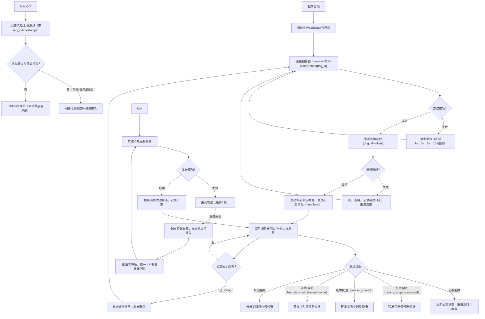
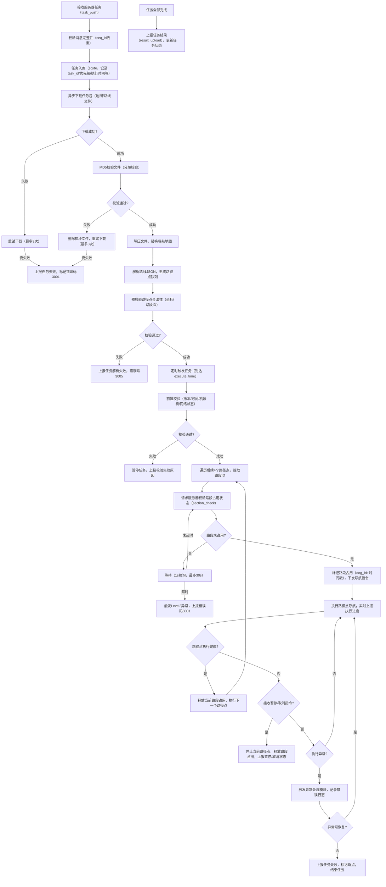
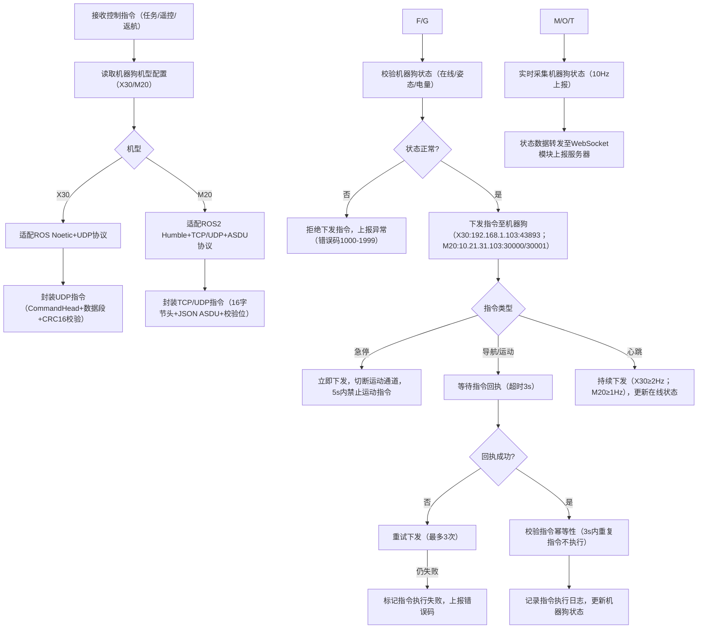
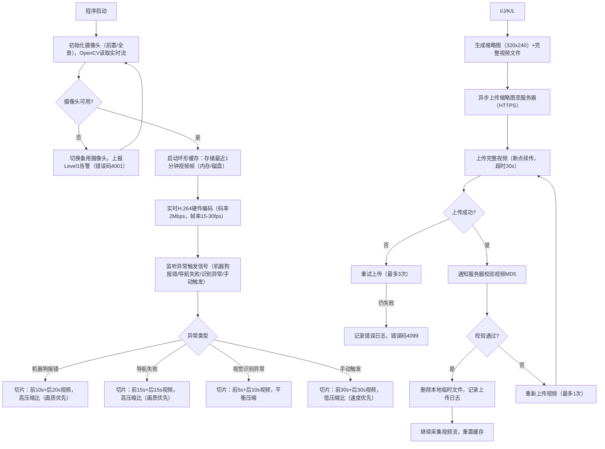
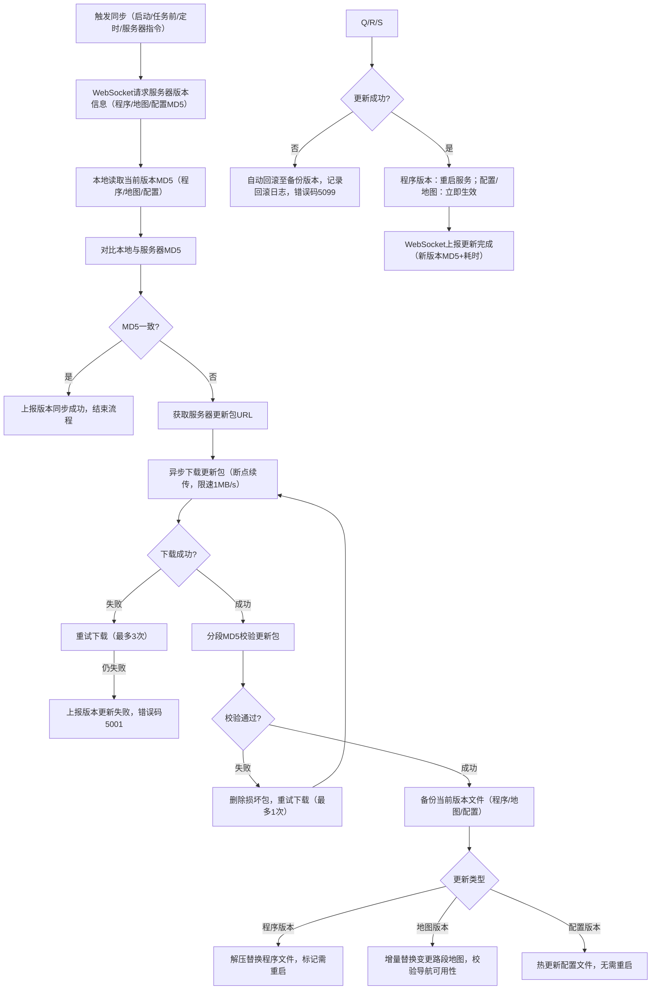
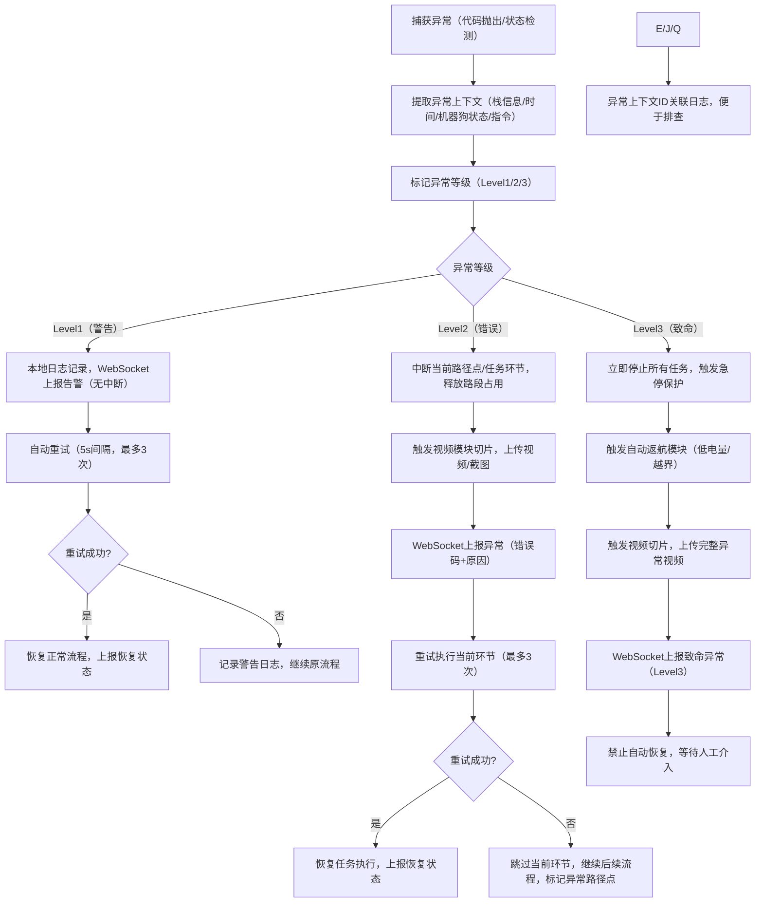
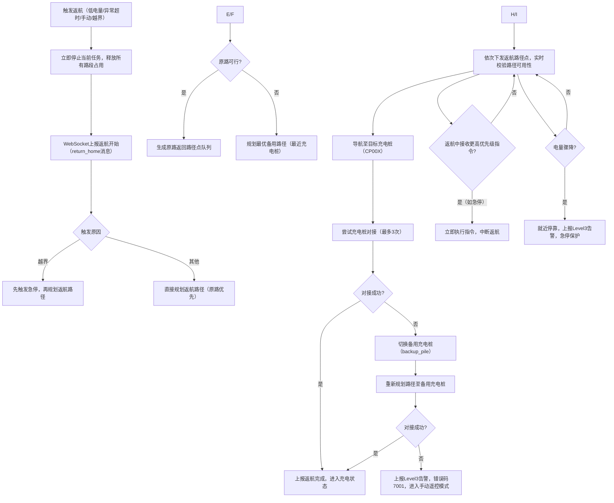
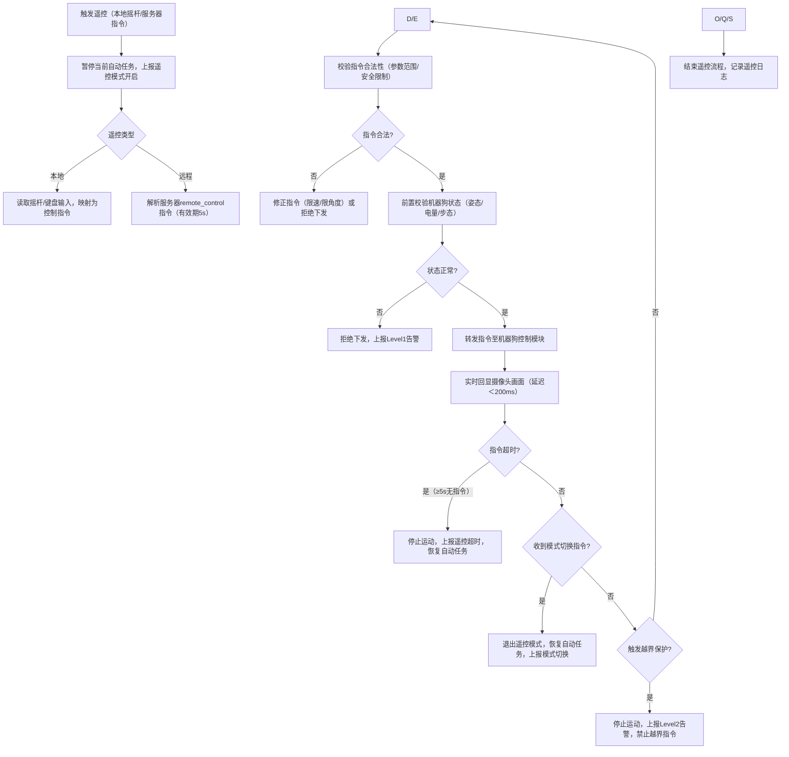
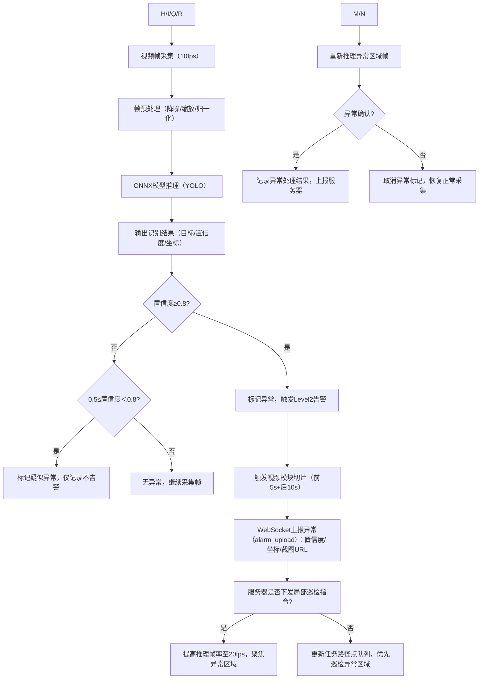

以下为机场廊桥巡检机器狗上位机程序各核心模块的流程图，采用Mermaid语法（可直接在支持Mermaid的工具/平台渲染），覆盖所有核心模块的核心逻辑与分支流程：

### 1. WebSocket服务器通信模块流程图

### 2. 任务管理模块流程图

### 3. 机器狗控制模块（双机型兼容）流程图

### 4. 视频处理模块流程图

### 5. 版本同步模块流程图

### 6. 异常处理模块流程图

### 7. 自动返航模块流程图

### 8. 手动遥控模块流程图

### 9. 模型识别模块流程图

### 渲染说明
1. 上述流程图基于Mermaid `graph TD`（自上而下）语法，可在Typora、Mermaid Live Editor（https://mermaid.live/）、GitLab/GitHub Markdown等平台直接渲染；
2. 每个流程图覆盖模块核心分支（成功/失败/重试/异常），与技术文档中模块逻辑完全对齐；
3. 关键错误码、触发条件、优先级规则均嵌入流程节点，可直接对应文档中的规范定义。