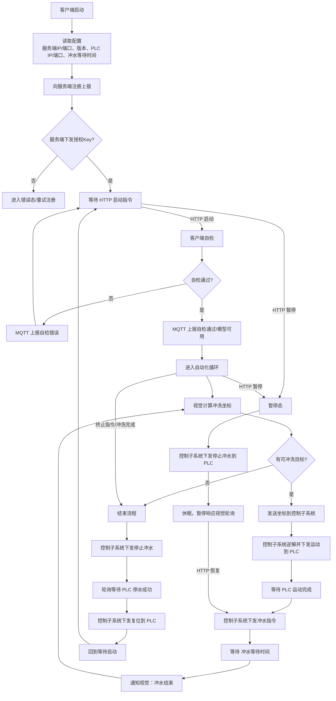

对象与术语
- 服务端：调度控制服务，提供 HTTP 控制接口，订阅/发布 MQTT 消息。
- 客户端：本程序，包含视觉子系统与控制子系统。
- 视觉子系统：负责目标检测与冲洗坐标计算；与相机、AI 模型交互。
- 控制子系统：负责逆运动学求解与运动控制；与 PLC 通信。
- PLC：可编程逻辑控制器，执行运动与冲水动作并上报信号。
- MQTT Broker：消息中间件（MQTT 服务器）。
- 授权 Key：服务端下发的通讯授权令牌，用于对请求进行加密/签名。
- 冲水等待时间：配置项（单位：秒）。

1. 客户端启动后向服务端注册。客户端从配置文件读取：服务端地址（IP/端口）、客户端版本、PLC 地址（IP/端口）、冲水等待时间等参数。
2. 注册上报内容包含：本机 IP/端口、客户端版本、客户端 ID。
3. 服务端收到注册后，下发通讯授权 Key。客户端后续请求使用该 Key 对请求进行签名或加密（调试模式可关闭），具体算法后续确认。

4. 通信方式：HTTP 用于启停与初始化；MQTT 用于程序状态和业务数据传输。
    4.1 车辆停稳后，服务端通过 HTTP 发送“启动”请求；客户端进入自动化流程，并通过 HTTP 返回“启动成功”。
    4.2 客户端执行自检：控制子系统（含与 PLC 的通信）、视觉子系统（相机通信、模型加载与推理）、与服务端的连通性。自检异常通过 MQTT 返回错误信息；自检通过则继续运行，并通过 MQTT 返回“模型可用/自检通过”信息。
    4.3 客户端并行运行视觉子系统与控制子系统（循环执行，直到冲洗结束或收到终止指令）。
        4.3.1 视觉子系统计算冲洗坐标，将坐标发送给控制子系统；控制子系统进行逆运动学求解，生成电机运动信息并下发给 PLC。
        4.3.2 指令下发给 PLC 后，视觉子系统等待控制子系统的“运动完成”与“冲水结束”通知。
        4.3.3 PLC 运动完成后，控制子系统下发冲水指令。
        4.3.4 冲水指令下发后，控制子系统等待冲水等待时间（秒），向视觉子系统发送“冲水结束”通知；视觉子系统收到后回到 4.3.1。
        4.3.5 若视觉子系统检测到无可冲洗目标，则进入 4.4 结束流程。
    4.4 收到终止指令或冲洗完成时，控制子系统发送停止冲水指令；轮询等待 PLC 返回“停水成功”信号后，控制子系统向 PLC 发送复位指令，重置运动状态。
    4.5 暂停与恢复
        4.5.1 运行中若收到服务端的 HTTP“暂停”指令，控制子系统下发停止冲水指令给 PLC 并进入休眠，暂停响应视觉子系统的轮询，等待 HTTP“恢复”指令。
        4.5.2 服务端发送 HTTP“恢复”指令后，从“下发冲水并反馈”阶段继续（即 4.3.3），并恢复对视觉子系统轮询的响应。

流程图（Mermaid）

控制子系统状态机清单（建议）
| 状态 | 进入动作（示例） | 触发事件/条件 | 下一状态 |
|---|---|---|---|
| INIT | 初始化资源、加载配置、初始化通信 | 启动完成 | REGISTERING |
| REGISTERING | 向服务端注册上报 | 收到授权 Key | WAIT_START |
| REGISTERING | 向服务端注册上报 | 超时/失败 | ERROR 或 REGISTERING（重试） |
| WAIT_START | 空闲等待 | HTTP 启动 | SELF_CHECK |
| SELF_CHECK | 检查 PLC 通信、控制模块、与服务端连通 | 自检通过（并 MQTT 上报） | RUN_IDLE |
| SELF_CHECK | 检查 PLC 通信、控制模块、与服务端连通 | 自检失败（并 MQTT 上报） | WAIT_START |
| RUN_IDLE | 等待视觉坐标/轮询响应打开 | 收到视觉坐标 | PLAN_MOTION |
| PLAN_MOTION | 逆运动学求解、生成运动指令 | 求解成功 | SEND_MOTION |
| PLAN_MOTION | 逆运动学求解、生成运动指令 | 求解失败 | ERROR（并上报） |
| SEND_MOTION | 下发运动指令到 PLC | 下发成功 | WAIT_MOTION_DONE |
| WAIT_MOTION_DONE | 监听 PLC 反馈 | PLC 运动完成 | WATER_ON |
| WAIT_MOTION_DONE | 监听 PLC 反馈 | 超时/故障 | ERROR（并上报） |
| WATER_ON | 下发冲水指令到 PLC | 下发成功（并上报运动完成） | WAIT_WATER_TIME |
| WAIT_WATER_TIME | 计时等待冲水等待时间 | 计时到 | NOTIFY_WATER_DONE |
| NOTIFY_WATER_DONE | 通知视觉“冲水结束” | 通知完成 | RUN_IDLE |
| PAUSED | 进入休眠，暂停响应视觉轮询 | HTTP 恢复 | WATER_ON（对应 4.3.3） |
| PAUSED | 进入休眠，暂停响应视觉轮询 | HTTP 终止 | STOPPING |
| STOPPING | 下发停止冲水指令 | 已下发 | WAIT_WATER_STOPPED |
| WAIT_WATER_STOPPED | 轮询 PLC 停水成功信号 | 停水成功 | RESETTING |
| RESETTING | 下发复位指令，重置运动状态 | 复位完成 | WAIT_START |
| ERROR | 记录故障、上报错误、进入安全停机流程（必要时停水/复位） | 错误已处理 | WAIT_START 或 INIT |

PLC 状态机清单（建议）
| 状态 | PLC 行为（示例） | 触发事件/条件 | 下一状态 |
|---|---|---|---|
| PLC_IDLE | 等待运动/冲水/复位指令 | 收到运动指令 | PLC_MOVING |
| PLC_MOVING | 执行运动控制 | 运动完成信号置位 | PLC_MOVE_DONE |
| PLC_MOVING | 执行运动控制 | 故障/急停/超限 | PLC_FAULT |
| PLC_MOVE_DONE | 保持到位/等待后续指令 | 收到冲水开始指令 | PLC_WATERING |
| PLC_WATERING | 打开水阀/执行冲水 | 收到停止冲水指令 | PLC_WATER_STOPPING |
| PLC_WATER_STOPPING | 关闭水阀并确认 | 停水成功信号置位 | PLC_WATER_STOPPED |
| PLC_WATER_STOPPED | 保持停水状态 | 收到复位指令 | PLC_RESETTING |
| PLC_RESETTING | 清除运动/冲水相关状态、复位寄存器 | 复位完成 | PLC_IDLE |
| PLC_FAULT | 进入故障安全状态（停水、停机等） | 故障解除并复位 | PLC_RESETTING 或 PLC_IDLE |
